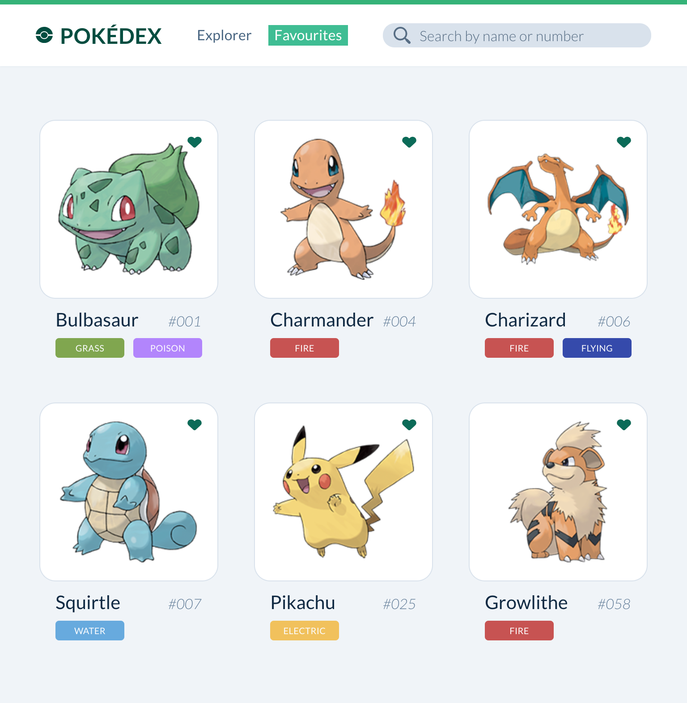

# Building a modern web application workshop — Le Pokédex

In this workshop we will use modern tools and industry best practices to build a Pokédex web application.

You can find an example implementation of this application at https://pokedex.tiagonunes.dev, with bugs and everything.
Can you find any? 🐛🕵️‍♂️

## Workshop resources

- [Chat room](https://tlk.io/mindera-webdev-workshop)
- [Poke API docs](https://pokeapi.co/docs/v2.html)
- MDN docs for [HTML](https://developer.mozilla.org/en-US/docs/Web/HTML), [CSS](https://developer.mozilla.org/en-US/docs/Web/CSS) and [JavaScript](https://developer.mozilla.org/en-US/docs/Web/JavaScript)
- [React docs](https://reactjs.org/docs/)
- [Next.js docs](https://nextjs.org/docs)
- [Can I Use](https://caniuse.com)
- [SVGR Playground](https://www.smooth-code.com/open-source/svgr/playground/)
- Project design specs in [Zeplin](https://zeplin.io) — Shared during workshop

## Requirements

- [Node](https://nodejs.org) >= 12.13
- [Yarn](https://yarnpkg.com) >= 1.21
- [Git](https://git-scm.com)
- A terminal/console (e.g. [iTerm](https://iterm2.com))
- A code editor (e.g. [VSCode](https://code.visualstudio.com))
  - [vscode-styled-jsx](https://github.com/iFwu/vscode-styled-jsx)
  - [vscode-styled-jsx-languageserver](https://github.com/Grimones/vscode-styled-jsx-languageserver)
  - [prettier-vscode](https://github.com/prettier/prettier-vscode)
  - [vscode-eslint](https://github.com/Microsoft/vscode-eslint)
  - [editorconfig-vscode](https://github.com/editorconfig/editorconfig-vscode)
- A web browser, or multiple (e.g. [Chrome](https://www.google.com/chrome/), [Firefox Developer](https://www.mozilla.org/firefox/developer/))
  - [React Developer Tools](https://chrome.google.com/webstore/detail/react-developer-tools/fmkadmapgofadopljbjfkapdkoienihi?hl=en)

## Setup

#### Clone the repository
> git clone [git@github.com:tnunes/pokedex.git](https://github.com/tnunes/pokedex)

#### If you have [nvm](https://github.com/nvm-sh/nvm) installed, then run:
> nvm use

#### Install dependencies
> yarn install

#### Run the project in development mode
> yarn dev

## Steps
Start by ensuring your environment is setup will all the workshop requirements and executing the 
setup tasks above to have a development server up and running.

Let's now take a look at our designs specs in Zeplin and plan our work.

### Step 1
Review code boilerplate structure.

### Step 2
Let's implement our header. Following a mobile-first approach, we can tackle the header implementation in the following order:

- Mobile Header
- Desktop Header
- Large Desktop Header
- Navigation transitions — open Favourites page

Let's now ensure our implementation is pixel-perfect with the Zeplin pop-out overlay ✨

### Step 3
Time to build our Pokemon Explorer. In this step we'll start interacting with the Poke API. Let's do mobile-first again.

- Mobile Explorer
- Desktop Explorer

### Step 4
Our Explorer is so shiny and pretty, but we can spruce it up and handle loading and error states.

- Handle loading state
- Handle error state

### Step 5 (optional, can also be done at the end, as an improvement)
The perceived time a task takes to finish is often more important for the user of an application than the actual time it takes.

[Skeleton screens](https://uxdesign.cc/what-you-should-know-about-skeleton-screens-a820c45a571a) can be used to decrease the perceived
time something takes to load and maintain the user engaged with our application.

We can use something like [react-content-loader](https://github.com/danilowoz/react-content-loader) to implement progressive loading
for our pokemon cards.

- Add skeleton loading for the pokemon card
- Make skeleton loading progressive by adding a skeleton to the pokemon image
- Improve the images appearing effect by using a smooth fade-in effect
- Don't forget to handle image loading errors

### Step 6
We love those beautiful few pokemons, but we really want to explore the whole pokemon universe. Let's add some pagination to be able
to load more pokemons into our pokédex.

- Add pagination support

### Step 7 (optional, can also be done at the end, as an improvement)
Users are so used to content loading automatically whenever we reach the end of the current page that we can improve their experience by
automatically loading the next page when needed without having to wait for a click in the "Load more" button.

The [IntersectionObserver](https://developer.mozilla.org/en-US/docs/Web/API/Intersection_Observer_API) is our friend here.

- Add "infinite scroll" pagination to the pokemon explorer

### Step 8
We're now seeing all these beautiful pokemons, but we really want to save our favourites. Time to build our Favourites page!

Since we built our code modular and clean with style, we can now reuse most of our components for the favourites grid, can't we?

Without API support for favourites management, we can save our favourites locally in the browser using something like [localStorage](https://developer.mozilla.org/en-US/docs/Web/API/Window/localStorage).

- Build local favourites addition and deletion functionality
- Integrate with the pokemon card
- Show favourite pokemons in the favourites page
- How does the favourites page look before the user collects favourite pokemons? Can we make it appealing?

### Step 9
It's taking a really long time of scrolling and scrolling to find some of our favourite pokemons, isn't it? It's time to add a search
feature to our application, so that we can zoom in directly in the ones we choose.

The Poke API does not provide search functionality, so how can we best tackle this challenge?

- Consider possible approaches, evaluate pros and cons
- Add search functionality

### Step 10 (optional, can also be done at the end, as an improvement)
Those pokemons images can really weigh on our app and affect our load times in slower networks. We can implement lazy-loading for the
images, so that they only load whenever they become visible on screen. Did we learn any API or technology that could help us achieve that?

- Implement images lazy loading

### Step 11
Our app is so shiny and slick, but is there something missing? Is it fast? Is it usable by anyone regardless of disabilities? Is it accessible? Will search engines rank it high? Are we using best practices?

Time to audit our application. We can start by using the Audit panel in Google Chrome Development Tools and look at the lighthouse report.

- Audit our app in both desktop and mobile
- Act on the report feedback. Can we increase our scores?

### Step 12 (optional)
The Poke API requires multiple requests to load the data we need for our pokédex. For a single page where we show 24 pokemons, we need to
make 25 requests (not counting requests for pokemon images)! That's a lot. Shouldn't one be enough?

We can't change the Poke API, but we can put a new API in front of it to aggregate and transform data exactly as we need it in our app.

What are our technology options? Should we make another REST API? Could GraphQL be an option here?

- Create a "proxy API" for the Poke API. Can be either REST or GraphQL ([Apollo Server](https://www.apollographql.com/docs/apollo-server/) and [Apollo Client](https://www.apollographql.com/docs/react/) could be your friends)
- Integrate the new API in our app. How faster is it now?

### Step 13
Our app runs so great in our machine, but can we put it live and share it with friends?

You can explore hosting options and deploy your app to the cloud.

Some hosting providers with free plans:
- [Netlify](https://www.netlify.com)
- [Heroku](https://www.heroku.com)
- [ZEIT Now](https://zeit.co)

### Step 14
What now? Are we happy with our app? What other features or improvements can you think of adding?

A few suggestions for future work that you can explore:

- Add unit tests to our components with [Jest](https://jestjs.io) and [react-testing-library](https://github.com/testing-library/react-testing-library)
- Add end-to-end tests with [Cypress](https://www.cypress.io)
- Move favourites support to the API and allow signin and managing favourites across devices
- Add a pokemon details page
- Add filters to the pokemon explorer
- Make a pokemon battle simulator

If you can imagine it, you can build it! Don't forget to share your creations 🚀
